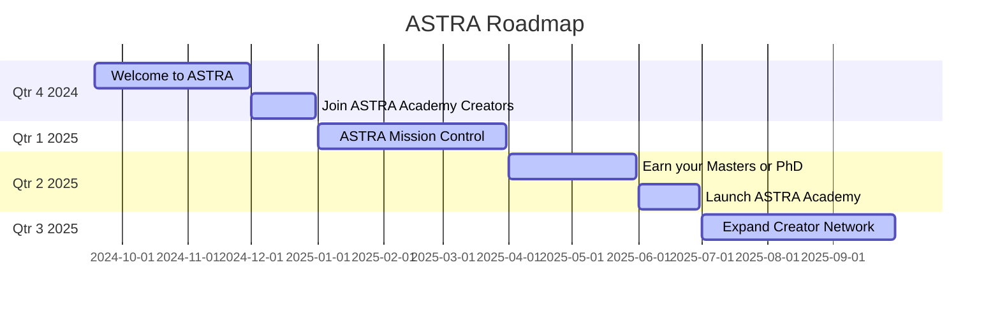

# ASTRA
The ASTRA is a program of Arts, Sciences, and Technology, Reasoning, and Automation. ASTRA offers a unique academic experience leading to IT, Psychology, Arts and Science. 
ASTRA Program will help you choice between different learning modalities that would allow you to get your university degrees. ASTRA Program would help you get Bachelors, Masters and PHD degrees. 

## ONLINE LEARNING: The program is specially designed to help you learn even when you are sitting anywhere in the world. 
Provides you digital content and synchronous interaction with instructors using Google applications.

## CORRESPONDENCE LEARNING: A program designed for students that will help in self-directed learning.
Provides you with modules for self-directed learning via reels, videos and email.

No matter who you are, we will help you achieve your best personal vision of yourself. We are student-focused, strive to understand your aspirations. At ASTRA, your passion will fuel your ambition which is our mission.

## Interest-driven curricula and activities:
Our course offerings and topics cater to students’ personal interests through tasks, assessments, capstone/culminating activities, etc. enabling students to discover their different strengths and use their interests to broaden their horizons, making their education enjoyable, meaningful, and valuable beyond the diploma or degree. Students learn better due to a learning approach that caters to their interests.

## Provision of interest-based student activities: 
We have student-driven workshops and activities that integrate student interests, not just academics, where students can explore and deepen their passion.

## Inside ASTRA Program: A lot of exciting things will happen inside ASTRA. The distance will not stop our interest-based events and contests, leadership training for student organization officers, learnings of which can be cascaded to their members, and community partnerships matching student needs and interests.

## Community-based programs: 
Students will also get to apply their interests in community-based projects that can help create a lasting and meaningful impact on the community as well. 
